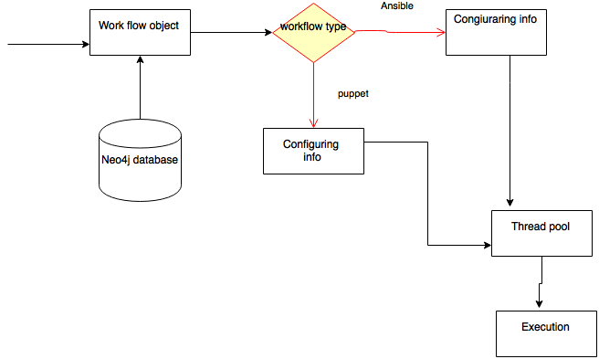

Workflow - General meaning of workflow is a process in which business processing
           steps will be converted to software execution phases to automate business steps.
           Example: Steps involved in receiving order from online to a delivery of product to the customers.

          Domain Specific Languages(DSL) languages are often used to write instructions. YAML is such language used in actiegrid.

In activegrid application, Workflow term is used in a different context that "scheduling a configuration management
script".There are two types of configuration management plugins are included in existing activegrid application

1. Ansible
2. Puppet

It have been observed that most implementation bound to Ansible, Though general design of the application support both
ansible and puppet plugins but unlike ansible, no exclusive steps for  Puppet execution haven't seen in the code.
Compared to ansible, more puppet related scripts are written and included.

Mcollective an ansible module, included in the code base. It enable parallel execution of tasks and dynamic host discovery over
large distributed network of nodes.

Puppet support in-machine or remote system configuration. In active application remote system configuration used.

There is a tab in the activegrid user interface to upload configuration module.
As of now Ansible and Puppet modules are supported in the screen.

